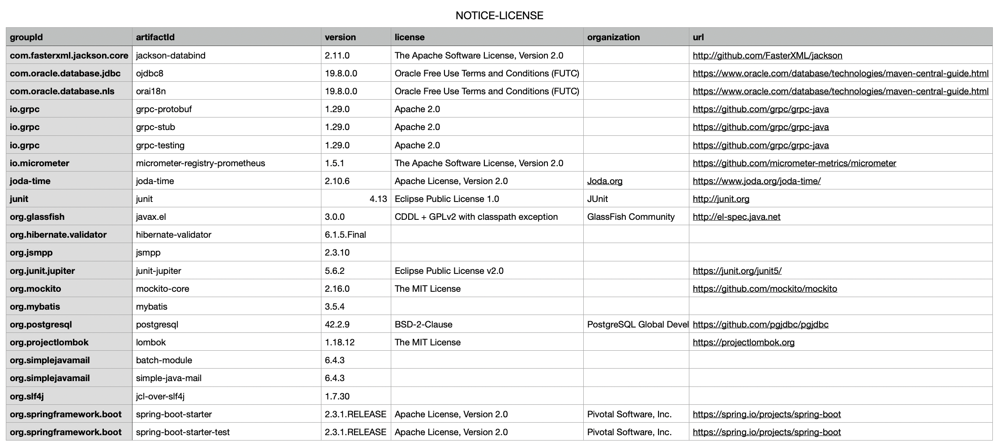
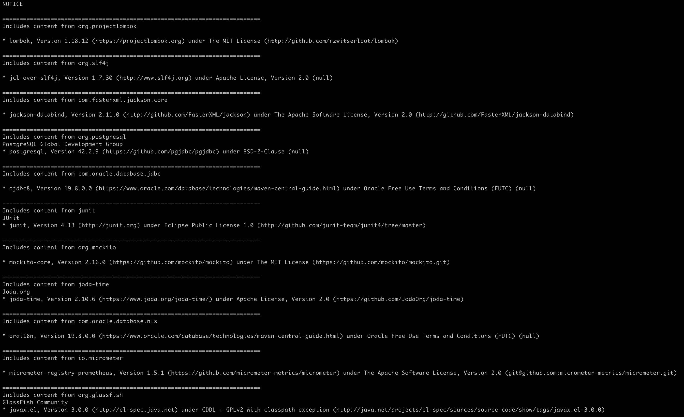

# Generate Maven project dependency report
[](https://www.apache.org/licenses/LICENSE-2.0.txt)
[](https://maven-badges.herokuapp.com/maven-central/io.github.coolbeevip/license-maven-plugin/)
[](https://api.securityscorecards.dev/projects/github.com/coolbeevip/license-maven-plugin)

## Goals Overview

Generate dependency reports in CSV, NOTICE, POM format, and try to analyze dependent LICENSE information.

* CSV Report



* TXT Report



## Usage

You generate dependency reports in the project directory. like this:

**Note:** If your project is a multi-module maven project, please use the `mvn install` command to install the artifacts to the local repos.

```shell
mvn io.github.coolbeevip:license-maven-plugin:1.16.0:dependency-license-export
```

**Note:** By default, NOTICE.CSV report is generated under the target/distribute

## Optional Parameters

| Name           | Type    | Since | Description                                                                                                  |
|----------------|---------|-------|--------------------------------------------------------------------------------------------------------------|
| format         | String  | 1.3.0 | Report format: csv txt pom, **Default value is: csv**                                                        |
| ignoreGroupIds | String  | 1.3.0 | Ignore artifact groupId, multiple commas separated, for example: org.my.project,org.your.project             |
| timeout        | Integer | 1.3.0 | Analysis timeout, **Default value is: 60**                                                                   |
| deep           | Integer | 1.4.0 | Indirect Dependency Analysis Depth, **Default value is: 100**                                                |
| license        | Boolean | 1.3.0 | Try to crawl https://search.maven.org/artifact/ data to get License information, **Default value is: false** |

## Examples

* Generate a dependency report in TXT format
  ```shell
  mvn io.github.coolbeevip:license-maven-plugin:1.16.0:dependency-license-export -Dformat=txt
  ```
* Ignore artifacts for groupId org.my 
  ```shell
  mvn io.github.coolbeevip:license-maven-plugin:1.16.0:dependency-license-export -DignoreGroupIds=org.my
  ```
* Only analyze 10 layers of deep dependencies
  ```shell
  mvn io.github.coolbeevip:license-maven-plugin:1.16.0:dependency-license-export -Ddeep=10
  ```
* Generate a report to try to get License information 
  ```shell 
  mvn io.github.coolbeevip:license-maven-plugin:1.16.0:dependency-license-export -Dlicense=true
  ```
* Set analysis timeout 120 sec
  ```shell
  mvn io.github.coolbeevip:license-maven-plugin:1.16.0:dependency-license-export -Dtimeout=120
  ```

